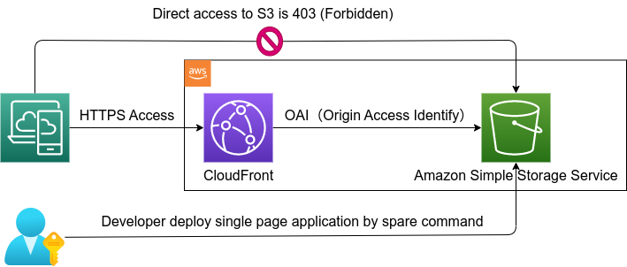
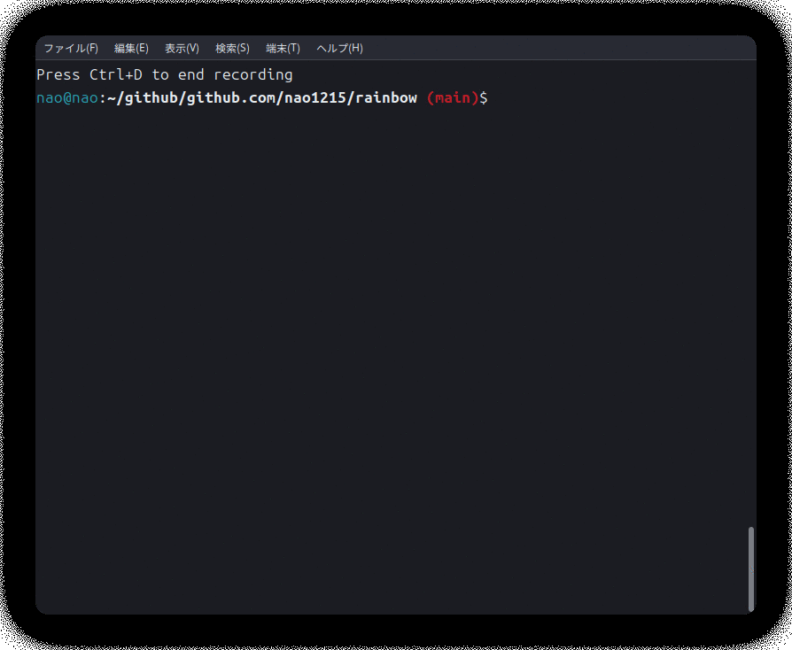

<!-- ALL-CONTRIBUTORS-BADGE:START - Do not remove or modify this section -->

<!-- ALL-CONTRIBUTORS-BADGE:END -->

## rainbow 
> [!IMPORTANT]  
> This project is under development. Do not use it in production environments.

The rainbow project is a toolset for managing AWS resources. This project consists of multiple CLI and CloudFormation templates. **I plan to implement TUI mode (Interactive mode) for all CLI commands.**  
  
This project adopts README-Driven Development. Therefore, while there may be a README, there might not be any code yet. If you have any feedback regarding the README, please write down in the Issues.

## Supported OS & Go version
- Linux
- Go 1.19 or later
  
I plan to support Mac. Until certain features are added, it has been excluded from the scope of unit testing.  

Windows is not supported because the tools used in unit testing do not run in a Windows environment. However, it is expected that some features will function in a Windows environment to some extent.

## CLI List
|Name|README|implementation|Description|
|:--|:--|:--|:--|
|[s3hub](./doc/s3hub/README.md)|✅|100%|User-friendly s3 management tool|
|[spare](./doc/spare/README.md)|✅|50%|Single Page Application Release Easily|
|[cfn](./doc/cfn/README.md)|✅|10%|List up or delete CloudFormation stacks|

### s3hub example
The s3hub command provides following features:
- [x] Create a S3 bucket
- [x] List S3 buckets
- [x] List S3 objects in the S3 bucket
- [x] Copy files to S3 bucket
- [x] Delete contents from the S3 bucket
- [x] Delete the S3 bucket
- [x] Interactive mode
  

### spare example
The 'spare' command makes easily the release of Single Page Applications. Spare constructs the infrastructure on AWS to operate the SPA, and then deploys the SPA (please note that it does not support building the SPA). Developers can inspect the infrastructure as CloudFormation before or after its construction.

The infrastructure for S3 and CloudFront is configured as shown in the diagram when you run the "spare build" command.  

> [!WARNING]  
> The spare command is deleted from the repository. At the very least, the development priority is low.

### cfn example
The cfn command provides the following features:
- [x] List stacks
- [ ] Delete stacks (Not implemented yet)

## CloudFormation Template List
|Name|README|implementation|
|:--|:--|:--|
|[Lambda batch with EventBridge (CloudWatch Events)](./cloudformation/lambda-batch/README.md)|✅|100%|
|[Lambda with API Gateway](./cloudformation/lambda-with-api-gw/README.md)|✅|100%|
|[Daily Cost Notification](./cloudformation/daily-cost-notification/README.md)|✅|100%|
|[CloudWatch Real User Monitoring (RUM)](./cloudformation/cloudwatch-rum/README.md)|✅|100%|
|[Static Web Application Distribution](./cloudformation/static-web-site-distribution/README.md)|✅|100%|

## LICENSE
This project is licensed under the terms of the MIT license. See the [LICENSE](./LICENSE) file.

## Contributing
Contributions are welcome! Please see the following documents for details:
- [CONTRIBUTING.md](./CONTRIBUTING.md)
- [Code of Conduct](./CODE_OF_CONDUCT.md)
- [Principle](./doc/common/principle.md) 
- [Development Eviorment Setup](./doc/common/developers.md)

This project incurs costs on AWS, and financial support from you would make it easier to maintain the project. If you wish to provide financial support, please do so through [GitHub Sponsors](https://github.com/sponsors/nao1215)

## GitHub Star History
GitHub Star is motivation for me. If you like this project, please star it.

## Unit Test Coverage Treemap

## Special Thanks

[LocalStack](https://www.localstack.cloud/) is a service that mocks AWS, covering a wide range of AWS services. It is not easy to set up an AWS infrastructure for personal development, but LocalStack has lowered the barrier for server application development.

It has been incredibly helpful for my technical learning, and among the open-source software (OSS) I encountered in 2023, LocalStack is undoubtedly the best tool. I would like to take this opportunity to express my gratitude.

## Contributors ✨
Thanks goes to these wonderful people ([emoji key](https://allcontributors.org/docs/en/emoji-key)):

<!-- ALL-CONTRIBUTORS-LIST:START - Do not remove or modify this section -->
<!-- prettier-ignore-start -->
<!-- markdownlint-disable -->
<table>
  <tbody>
    <tr>
      <td align="center" valign="top" width="14.28%"><a href="https://debimate.jp/"> <b>CHIKAMATSU Naohiro</b></a> <a href="https://github.com/nao1215/rainbow/commits?author=nao1215" title="Code">💻</a></td>
    </tr>
  </tbody>
</table>

<!-- markdownlint-restore -->
<!-- prettier-ignore-end -->

<!-- ALL-CONTRIBUTORS-LIST:END -->

This project follows the [all-contributors](https://github.com/all-contributors/all-contributors) specification. Contributions of any kind welcome!
