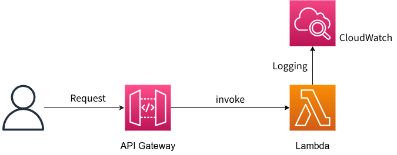

## API Gateway with Lambda
### Overview

Lambda and API Gateway combined infrastructure is a powerful means for realizing serverless architecture. Lambda is a service for executing code, while API Gateway creates HTTP endpoints and forwards requests to Lambda functions.



This combination offers the following characteristics:

- Simplified Serverless Architecture: Combining API Gateway with Lambda allows for the creation of a serverless architecture, eliminating issues with server management and scaling.
- Cost Efficiency: Being billed only for the resources you use, costs can scale with traffic, reducing wasteful spending.
- Seamless Integration: API Gateway provides seamless integration with Lambda, allowing you to define API endpoints and route requests to Lambda functions.
- Facilitates the implementation of microservices architecture, allowing deployment of independent Lambda functions for each functionality.

### Limitations
- Long Processing Time: Lambda functions are limited by execution time. If long processing is required, Lambda might not be suitable. Alternative methods should be explored for long-running processes.
- Heavy Data Processing: Lambda functions have resource limits. For tasks requiring heavy data processing or significant memory, other services or architectures might be more suitable.
- Always Active Services: Lambda is event-driven and goes to sleep when there are no requests. For services that need to be always active or for background processing, Lambda might not be appropriate.


### How to deploy
> [!NOTE]
> Before running `make deploy`, ensure you have configured AWS credentials and set the correct region. Otherwise, you use single sign-on (SSO).

```shell
$ make deploy
```

### Endpoint Base URL Syntax
The URL syntax for the API Gateway endpoint is as follows:

```
https://<api-id>.execute-api.<region>.amazonaws.com/<stage>
```

- `<api-id>`: The API Gateway ID.
- `<region>`: The AWS region where the API Gateway is deployed.
- `<stage>`: The stage name of the API Gateway.

