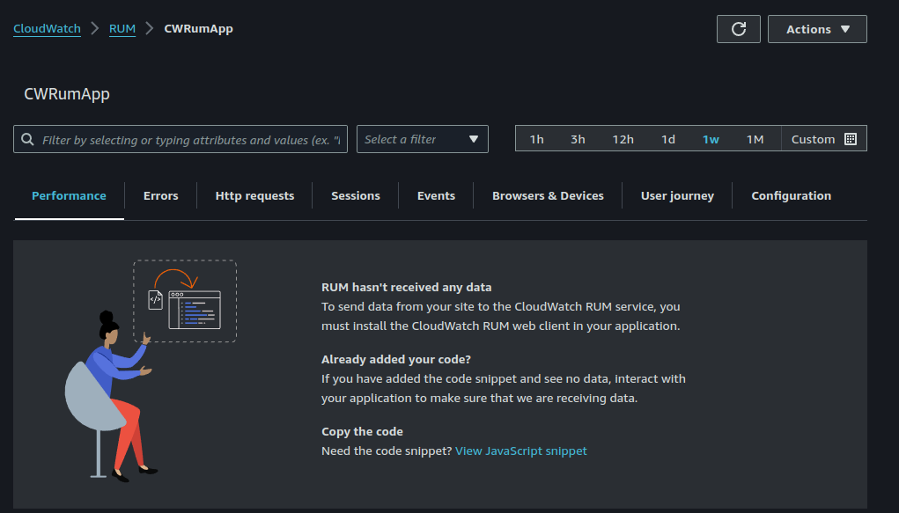
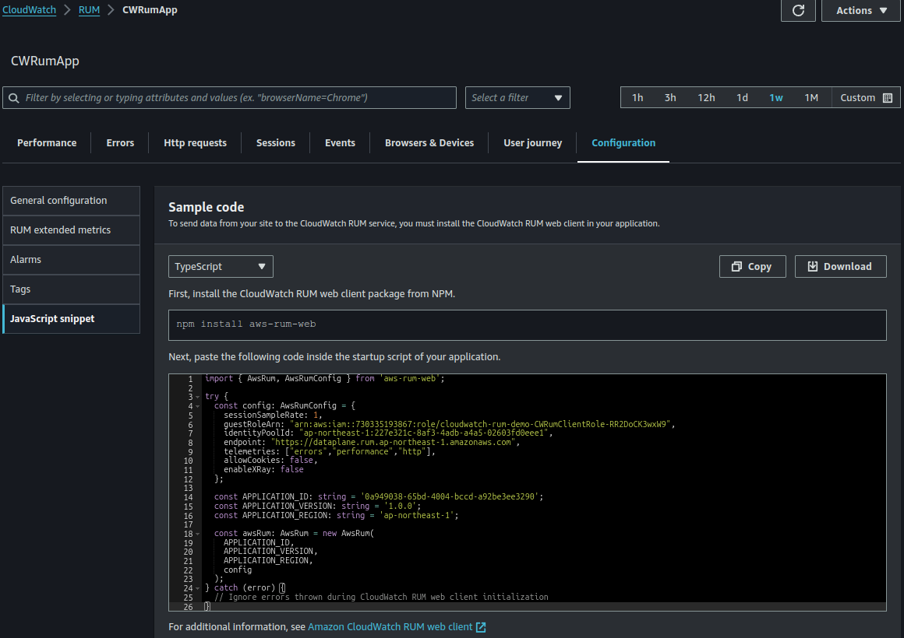

## CloudWatch Real User Monitoring (RUM)
### Overview

CloudWatch RUM (Real User Monitoring) captures client-side data on app performance in real-time, optimizing user experiences.

- It visualizes information about performance issues such as page load order and errors in JavaScript/HTTP responses on dashboards.
- Prioritizing fixes becomes easier by presenting the number of user sessions affected by the same issue.


### How to deploy
> [!NOTE]
> Before running `make deploy`, ensure you have configured AWS credentials and set the correct region. Otherwise, you use single sign-on (SSO).

```shell
$ make deploy
```

### Send data to CloudWatch RUM 
To send data from your site to the CloudWatch RUM service, you must install the CloudWatch RUM web client in your application.

The code examples are located in [CloudWatch] > [RUM] > [Application Name] > [Configuration] > [Javascript snippet]. TypeScript, JavaScript, and HTML sample code are provided.

