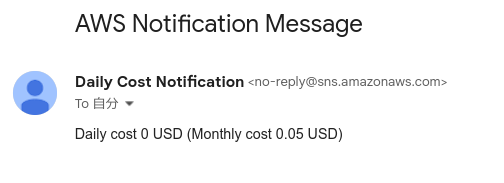

## Daily Cost Notification
### Overview
The Daily Cost Notification sends AWS costs to any email address via EventBridge, Lambda, and Amazon Simple Notification Service. You can stay informed about AWS costs regularly without needing to open the AWS Management Console.

### Architecture
EventBridge triggers Lambda once a day, Lambda aggregates costs from Cost Explorer, and then sends the information to a Simple Notification Service endpoint (in this case, an email address). The execution logs of Lambda are aggregated in CloudWatch Logs.

The architecture of this infrastructure configuration is as follows:


### How to deploy
> [!NOTE]
> Before running `make deploy`, ensure you have configured AWS credentials and set the correct region. Otherwise, you use single sign-on (SSO).

```shell
$ export EMAIL_ADDRESS=${YOUR_EMAIL_ADDRESS_HERE}
$ make deploy
```
The dependencies are [Golang](https://go.dev/doc/install) and [AWS Serverless Application Model (SAM) CLI](https://github.com/aws/aws-sam-cli). Please make sure to install them beforehand.

After deployment, you will receive an email from AWS to confirm the subscription to the topic. Please confirm the subscription to receive cost notifications.


After confirming the subscription, you will receive a daily email with the cost information.

