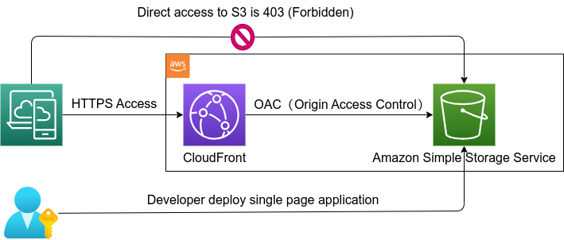

## Static Web Site Distribution With CloudFront and S3
### Overview
The simplest way to deploy the static website is to store the content in Amazon S3 (Simple Storage Service) and distribute it using CloudFront (Content Delivery Network).
  
This infrastructure configuration looks like the diagram below.　　

The configuration is characterized by its simplicity and the following features:

1. Cost-effectiveness
2. Responsive performance through effective utilization of caching (Cache Distribution pattern)
   
However, there are constraints. For example, if there is a functionality to rewrite a Relational Database on the client side, it cannot be accommodated with the infrastructure configuration depicted in the diagram.

#### Not allowed to access S3 directly
As a premise, you can host a static website using S3. In this context, a static website refers to content on individual web pages being static, although client-side scripts may be included.
  
In other words, S3 content can be publicly accessible, allowing direct access to S3. However, enabling public access to S3 poses security risks and the potential for information leakage. In general, public access to S3 should be disabled. For instance, there is a risk of personal information being stolen from S3 by third parties, or the possibility of delivering compromised JavaScript containing malicious code.
  
To prevent such scenarios, it is essential to appropriately configure the S3 bucket policy.

#### What is Origin Access Control (OAC)
Origin Access Control is a new feature of CloudFront that allows you to restrict access to S3 buckets from CloudFront. It is an alternative to Origin Access Identity (OAI), which is the conventional method of restricting access to S3 buckets from CloudFront.
  
The use of Origin Access Identity (OAI) in CloudFront involves specifying OAI for each origin, and on the S3 side, allowing read and write permissions for that OAI through bucket policies. This allows restricting access to S3 only from CloudFront, without making the S3 bucket publicly accessible. However, there are limitations when using OAI, such as incompatibility with AWS Key Management Service (AWS KMS) encryption and SSE-KMS in S3 buckets.
  
The newly available Origin Access Control (OAC) addresses these limitations. It supports accessing S3 buckets encrypted with SSE-KMS and enables both download and upload operations. Additionally, it overcomes the restriction related to the use of AWS Signature Version 4 (SigV4) in specific S3 regions, allowing POST and PUT requests, and requiring the addition of the x-amz-content-sha256 header for PUT requests during object uploads.

OAC also enhances security measures by supporting shorter credential durations and more frequent credential rotation. This provides better protection against credential-based attacks.

#### Why need CloudFront Access Logs
1. Enhanced Audit and Security: Storing CloudFront access logs in S3 provides a detailed history of access, enhancing security and facilitating the detection and investigation of unauthorized access.

2. Analysis and Monitoring: Access logs stored in S3 can be integrated with analysis tools and monitoring systems, aiding in quickly identifying traffic trends and performance issues.

3. Compliance with Legal Requirements: Some industries or legal requirements may mandate the retention of access logs and their accessibility when needed to comply with regulations.

#### CloudFront Cache
- [Understanding AWS CloudFront Caching: A Guide for Beginners](https://aws.plainenglish.io/understanding-aws-cloudfront-caching-a-guide-for-beginners-ce0169d3c724)