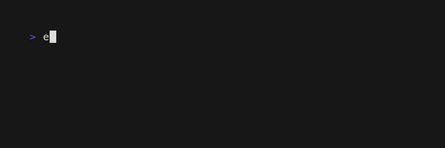
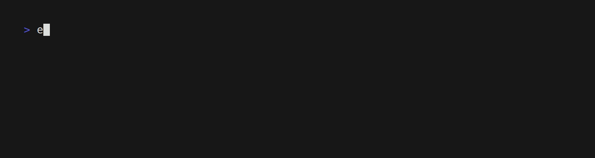
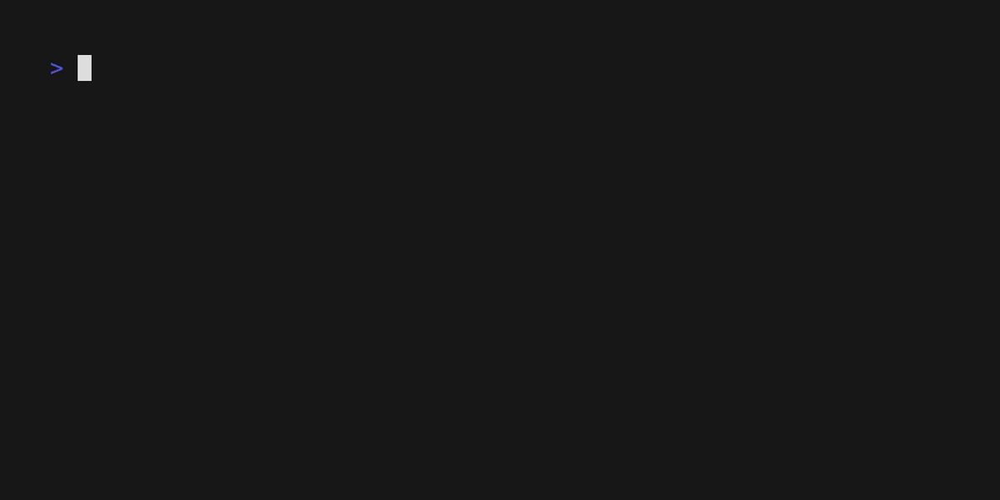

## s3hub - user-friendly S3 management tool
The s3hub command provides following features:
- [x] Create a S3 bucket
- [x] List S3 buckets
- [x] List S3 objects in the S3 bucket
- [ ] Copy files to S3 bucket
- [x] Delete contents from the S3 bucket
- [x] Delete the S3 bucket
- [ ] Interactive mode
  
## How to install
```shell
go install github.com/nao1215/rainbow/cmd/s3hub@latest
```

## How to use
The s3hub command allows you to specify a profile as an option, but it is more user-friendly to use the `AWS_PROFILE` environment variable. S3hub operates without requiring the 's3://' protocol to be added to the bucket name.

### Create a bucket(s)

```shell
s3hub mb ${YOUR_BUCKET_NAME}
```




### List buckets
```shell
s3hub ls
```



### List contents of a bucket
```shell
s3hub ls ${YOUR_BUCKET_NAME}
```


### Copy files to a bucket
From local to S3:
```shell
s3hub cp ${YOUR_FILE_PATH} ${YOUR_BUCKET_NAME}
```

From S3 to local:
```shell
s3hub cp ${YOUR_BUCKET_NAME} ${YOUR_FILE_PATH}
```

> [!IMPORTANT]  
> Not implemented yet.

### Delete a object from a bucket
If you want to delete a specific object, use the following command:
```shell
s3hub rm ${CONTENT_PATH_IN_BUCKET}/${S3_KEY}
```

If you want to delete all contents in a bucket, use the wildcard:
```shell
s3hub rm ${YOUR_BUCKET_NAME}/*
```

### Delete a bucket with objects
When the number of S3 objects is large, we parallelize the deletion process to enhance speed.
```shell
s3hub rm --recursive ${YOUR_BUCKET_NAME}
```




### Interactive mode
You can use the interactive mode by omitting the arguments.
```shell
s3hub
```


> [!IMPORTANT]  
> Not implemented yet.